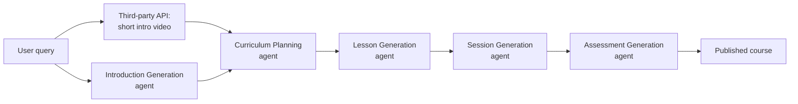
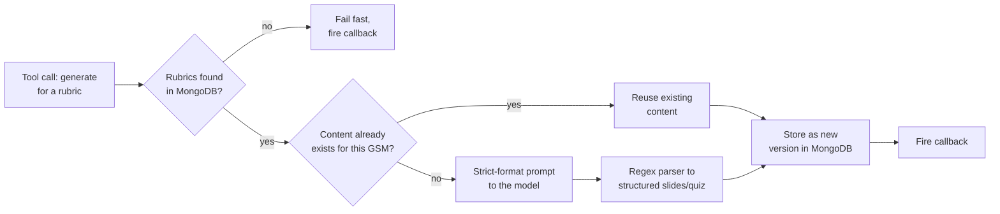
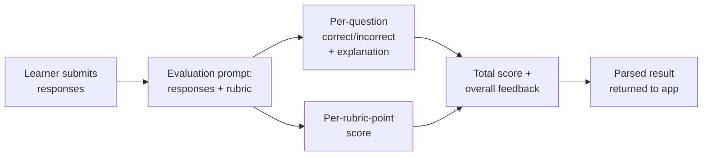
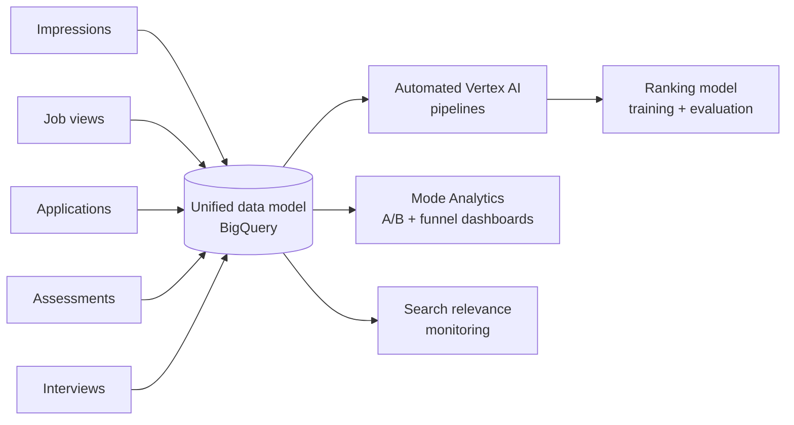
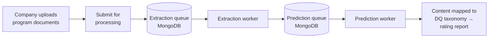
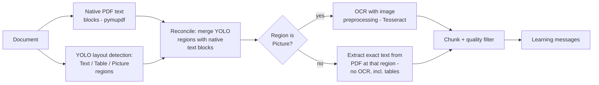
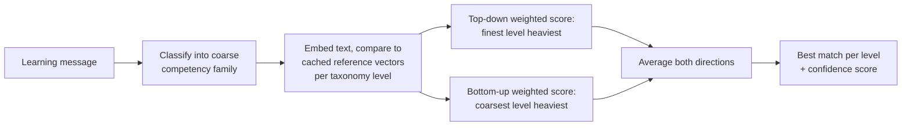
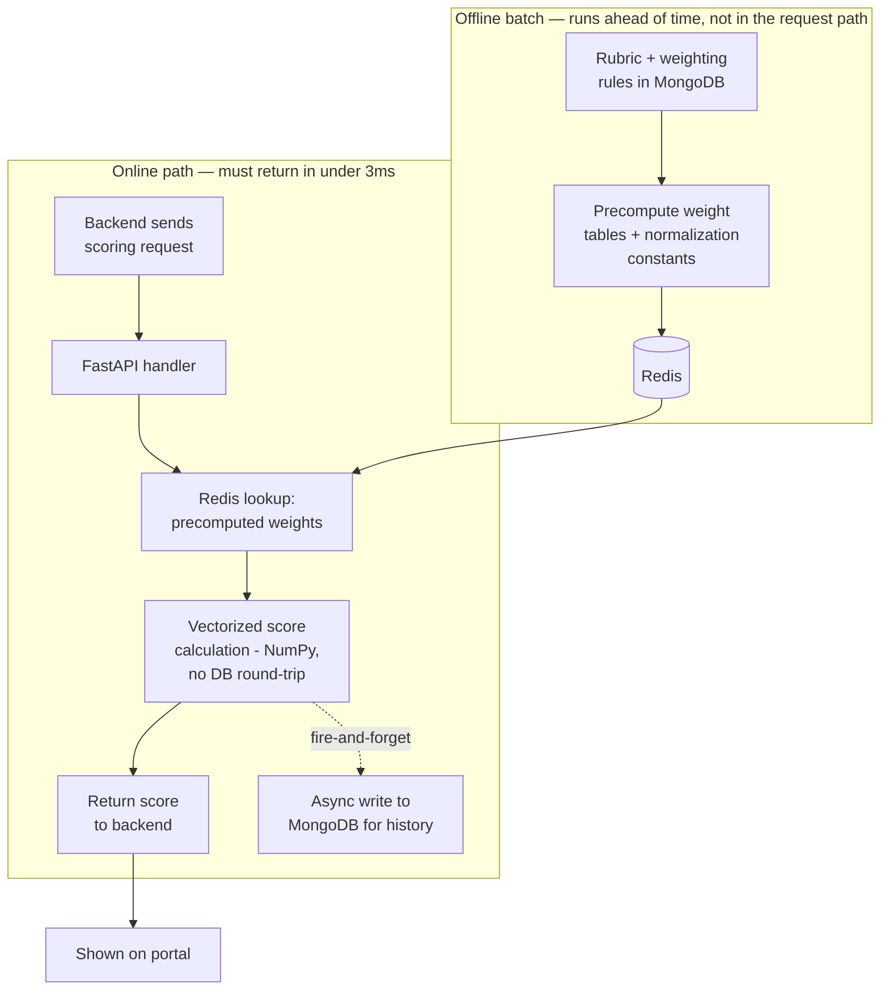
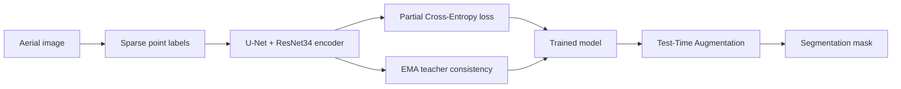

# Muhammad Obaidullah

Data Scientist and backend engineer. I build AI systems that have to actually survive
production — not just a notebook.

Portfolio: [muhammad-obaidullah.github.io](https://muhammad-obaidullah.github.io) · obaidullahdsk@gmail.com · +92 334 9841289

---

### Now

Actively looking for my next role — Data Scientist, AI Engineer, ML Engineer, or Forward
Deployed Engineer. Remote, open to relocation.

---

## Case studies

### 1. Agentic GenAI course-builder (DQ Lab)

**Challenge.** Course creators needed full learning materials and assessments generated
for a given audience — not a single AI-written paragraph, but a structured, multi-stage
output (intro, curriculum, lessons, sessions, assessments) that had to be consistent,
gradeable, and reliable enough to publish, hosted as a real application rather than a
one-off script.

**Design.** Two layers. A LangGraph orchestration layer plans and sequences the build;
underneath it, a Python/FastAPI generation engine does the actual work each stage calls
into — producing, parsing, and persisting content for one rubric at a time.

Every agent calls the same underlying layer rather than repeating logic itself:

- **Retrieval (ChromaDB)** — any stage that needs reference material pulls it via retrieval instead of relying on the model's memory.
- **Schema validation (TypeScript)** — each agent's output is checked against a defined schema before it's handed to the next stage, so a malformed curriculum can't silently produce a broken lesson.
- **LangSmith tracing** — every agent call and tool call is traced, so a bad course can be debugged stage-by-stage instead of as one opaque run.
- **Generation engine (below)** — the actual content-production, parsing, and persistence work for a given rubric.

**Inside the generation engine.** Each agent's tool call lands here to actually produce
content for one rubric:

**Closing the loop: assessment evaluation.** Publishing a quiz is only half the feature — a
learner's answers have to be scored against the rubric, not just marked right or wrong.
Once a learner submits responses to a generated assessment, a separate evaluation path
grades them against the same rubric-aligned student outcomes the assessment was built
from:

This closes the loop the resume bullet describes as "evaluate application activities based
on student responses": generation and evaluation share the same rubric-derived student
outcomes, so a learner is graded against exactly what the assessment was designed to test.

**Key engineering decisions**

| Challenge | How it was tackled | Why this approach |
|---|---|---|
| The model has no native structured-output mode available on this call path, but output has to become gradeable, storable data | Prompts enforce an exact text format (explicit section separators, a few-shot example of correct output) and a hand-written regex parser converts the response into structured slide/question objects | Keeps generation on a plain chat-completions call while still getting output reliable enough to store and grade |
| Regenerating content on every request wastes tokens and risks inconsistent rubric-aligned outcomes across runs | A predefined, curated dictionary of rubric-aligned student outcomes is checked first; existing learning content is reused if it already exists for that GSM; the model is only called when nothing already exists | Keeps outcomes consistent for rubrics that already have a vetted answer, and avoids paying generation cost twice for the same content |
| A multi-stage generation pipeline is too slow to run inside a single synchronous HTTP request | The pipeline runs as a background task; the endpoint returns immediately, and a callback fires once the course is ready | The caller never blocks on a pipeline that can run well past a typical request timeout |
| The OpenAI dependency can be down or rate-limited mid-pipeline | Health-checked before the pipeline starts; on failure the module is marked "failed" with no partial content instead of crashing mid-generation | Fails predictably and visibly rather than leaving a half-built module behind |
| A failure partway through generation could otherwise leave no record of what happened | Every exception is caught, logged with a full traceback, and still written as a new queryable version with status "failed" — and the callback still fires | Failures stay debuggable after the fact, and the caller is never left waiting indefinitely |
| Regenerating a module for the same rubric shouldn't silently overwrite the last known-good version | Looks up the latest version for the same gsm + curricula + target age and increments rather than overwriting | Keeps history auditable and protects a working version from being lost to a bad regeneration |
| A single pass/fail per question doesn't tell a learner or instructor *why* performance fell short on a specific rubric characteristic | Evaluation scores each rubric point independently on a 0/1/2 scale (not demonstrated / partially / fully demonstrated) and sums to a total, alongside per-question correctness | Mirrors how the content was generated — against individual rubric characteristics — so feedback is actionable at the same granularity the course was built at |

**Result.** Hosted, end-to-end system generating audience-specific learning materials,
assessments, and rubric-based evaluation of learner responses, with prompts iterated and
evaluated per agent using LangSmith traces.

**Stack:** OpenAI API, LangChain, LangGraph, LangSmith, ChromaDB, FastAPI, MongoDB, Python,
TypeScript.

---

### 2. Unified data model for ranking, experimentation & analysis (Turing)

**Challenge.** Signals that mattered for the product — impressions, job views,
applications, assessments, interviews — lived as disconnected datasets. That made it hard
to do three different jobs that all depended on the same underlying funnel: give ML
engineers clean training data for a ranking model, run trustworthy A/B tests, and test
product hypotheses with consistent attribution back to the events that caused them.

**Design.** Redesigned the data model around a single BigQuery source of truth connecting
every funnel stage, with automated Vertex AI workflows keeping it current, feeding three
distinct consumers rather than one.

**Use cases this unlocked:**
- **Model training** — clean, attributable training data for the ranking model, contributing ~3% model lift.
- **Experimentation** — Mode Analytics dashboards (SQL) comparing A/B experiments and funnel conversion off one consistent dataset instead of per-team pulls.
- **Hypothesis testing / monitoring** — search relevance tracked against the same unified signal set, plus duplicate-event and tracking fixes that improved overall data reliability.

**Key engineering decisions**

| Challenge | How it was tackled | Why this approach |
|---|---|---|
| Impressions, views, applications, assessments, and interviews didn't share a consistent grain or identifier | Resolved duplicate-event and tracking issues as part of the redesign itself | Fixing attribution at the source, rather than patching it downstream in every consumer, is what made ~75% coverage possible |
| ML training needs raw, granular events; A/B analysis and dashboards need stable, pre-aggregated definitions | One unified base layer in BigQuery, with Vertex AI pipelines and Mode Analytics dashboards each consuming it differently | Avoids maintaining two separate pipelines that could quietly drift out of sync with each other |
| Joining the full funnel history repeatedly across millions of records was too expensive to run often | Precomputed metrics and narrower joins | Keeps recurring queries from reprocessing the same event history every time |
| Needed a warehouse that scales with funnel-event volume and a way to automate recurring ML workflows against it | BigQuery + Vertex AI | BigQuery's columnar storage handles large joins cheaply when the schema is right; Vertex AI automates training/eval runs against that same warehouse without separate ML infrastructure |

**Result.** ~75% attribution coverage across the funnel, ~3% ranking-model lift, built
across millions of developer activity records; query efficiency improved through
precomputed metrics and narrower joins.

---

### 3. Client program onboarding: document extraction → DQ taxonomy mapping (DQ Lab)

**Challenge.** Companies submitting a digital-learning program for DQ certification upload
real-world program materials — PDFs and Word docs mixing tables, screenshots, and free
text — that need to be broken into discrete "learning messages" and matched against a
four-level competency taxonomy to produce a content-coverage rating. Manual review of this
was the bottleneck slowing down every new submission.

**Design.** Two stages, each a standalone worker process pulling off its own MongoDB-backed
queue rather than processing inline in the API request — extraction first, then
classification.

Both workers are long-running processes with retry limits and graceful shutdown handling,
not request-scoped tasks — documents can take a long time to run through layout detection,
OCR, and embedding models, well past anything an HTTP request should wait on.

**Inside extraction.** Each document goes through layout detection, then gets its text
filled in from whichever source is most reliable for that region — native PDF text where
it exists, OCR only where it doesn't:

**Inside classification.** Extracted text is matched against the competency taxonomy, from
broad to specific:

**Key engineering decisions**

| Challenge | How it was tackled | Why this approach |
|---|---|---|
| OCR is unreliable on text that's already extractable natively, but YOLO alone can't tell what a region actually says | Reconcile YOLO-detected regions against the PDF's native text blocks by bounding-box overlap; fall back to OCR only for regions YOLO classifies as pictures, extracting exact native text everywhere else, including tables | Native extraction is exact and fast; OCR is reserved for the one case where there's genuinely no text layer to read |
| OCR accuracy on image-embedded text was inconsistent | Preprocess cropped image regions (normalize, threshold, Gaussian blur) and constrain Tesseract to a specific character whitelist and page-segmentation mode before running it | Cleaning the image and narrowing what Tesseract is allowed to output measurably reduces garbage characters in the result |
| Not all extracted text is useful — headers, page furniture, and OCR noise would otherwise pollute the taxonomy mapping | A two-stage filter: a validity classifier drops non-sentence noise, then an education-relevance scorer drops anything below a tuned threshold | Keeps only text worth classifying, rather than asking the mapping stage to be robust against garbage input |
| A single flat classifier can't reliably place text at the right level of a 4-level taxonomy | Classify into a coarse competency family first, then within that family compute embedding similarity against cached reference vectors at finer levels, combining a top-down-weighted score and a bottom-up-weighted score | Trusting only one direction (coarse→fine or fine→coarse) missed cases the other direction caught; averaging both was more robust than either alone |
| Recomputing reference embeddings for the whole taxonomy on every request would be wasteful | Reference vectors per taxonomy code are precomputed once and reused for every comparison | Only the incoming text needs embedding at request time; the comparison set is fixed |
| A single heavy document-processing request could block the API, or get lost on a crash/restart | Both extraction and classification run as separate worker processes pulling from MongoDB-backed queues with retry limits and graceful shutdown handling | Decouples long-running ML work from the API's request/response cycle and survives a worker restart mid-job |

**Result.** Company-submitted program documents are automatically broken into discrete
learning messages and mapped against the DQ competency taxonomy with per-level confidence
scores, feeding the content-coverage rating report — removing manual review as the
bottleneck in the certification process.

**Stack:** YOLO, pymupdf, Tesseract OCR, OpenCV, DistilBERT, multilingual sentence-embedding
models, PyTorch, FastAPI, MongoDB, mongo-queue.

---

### 4. Scoring service: R → Python, then making it fast (DQ Lab)

**Challenge.** The original assessment scoring service was written in R. Porting it to
Python for the production stack was necessary, but a direct port was slow.

**Use case.** A user finishes an assessment on the portal → the backend sends this
service a scoring request → it has to compute and return the score in under 3 ms, because
the portal is waiting on that response to render the result on screen. There's no "loading"
state budgeted for a calculation — it has to feel instant.

**Design.** The approach moves everything that doesn't change per-request out of the
request path entirely, so the online path only ever does cheap, cached arithmetic.

**Key engineering decisions**

| Challenge | How it was tackled | Why this approach |
|---|---|---|
| The naive R→Python port kept a MongoDB round-trip and rubric recalculation inside the request path | Precompute rubric weights and normalization constants once, read them from Redis on every request | Rubric data doesn't change per request — recalculating or re-fetching it on every call was the main source of latency |
| The precomputation itself is too heavy to run per request | Runs as a batch job ahead of time, whenever rubric data changes, not inline with scoring | Keeps the online path from ever paying for work that doesn't depend on the current request |
| Row-by-row Python is much slower than R's implicit vectorization | Final score calculation uses NumPy on the already-cached inputs | Matches R's vectorized performance instead of regressing from it |
| Persisting score history competes with response latency | Write to MongoDB for history/dashboards after the response is already sent | The portal is only waiting on the score, not on whether it's logged — decoupling the two keeps logging off the critical path |

**Result.** Response times dropped from 3–5 seconds to under 3 ms.

---

### 5. Point-supervised segmentation of aerial imagery

**Challenge.** Dense, pixel-level segmentation masks for aerial imagery are expensive to
annotate at scale. Goal: accurate building/road/land/vegetation/water segmentation trained
from sparse point labels instead of full masks.

**Design.**

**Key engineering decisions**

| Challenge | How it was tackled | Why this approach |
|---|---|---|
| Comparing a model's prediction against its own prediction on a flipped image gave a noisy, unstable training signal, since the target came from the same still-learning model | Replaced the target with an EMA teacher — a slow-moving average of the student's weights | A target that changes slowly is more stable to train against than one that changes every step; basic same-model consistency only lifted mean IoU marginally even after tuning lambda and confidence threshold |
| Learning rate directly decided whether the pretrained encoder adapted to aerial imagery at all | Ran a controlled sweep: 5e-5 underfit (0.45 mean IoU), 1e-4 was stable but weak (0.57), 2e-4 won (0.61) | Picked from measured comparisons rather than a default value |
| Untrusted teacher pseudo-labels risk reinforcing the teacher's own mistakes | Confidence threshold of 0.8 before a pseudo-label counts toward the loss, plus a 5-epoch warm-up on point labels only before pseudo-labels are introduced | Prevents the student from learning noise during the period the teacher is least reliable |
| EMA decay was a direct accuracy-vs-IoU trade-off (0.995 gave better pixel accuracy, 0.99 gave better mean IoU under TTA) | Selected decay = 0.99 | Mean IoU was the primary metric for this task, so it took priority over pixel accuracy |

**Result.** Best configuration (Partial CE + EMA teacher consistency + TTA) reached
**0.7986 pixel accuracy** and **0.6371 mean IoU** on the Dubai aerial imagery dataset,
beating plain Partial CE (0.7941 / 0.6317).

[→ repo](https://github.com/muhammad-obaidullah/point-supervised-remote-sensing) ·
[→ full technical report](https://github.com/muhammad-obaidullah/point-supervised-remote-sensing/blob/main/reports/technical_report.md)

---

### Background

4+ years across data science and backend engineering: NLP/document extraction, GenAI
applications (LangChain, LangGraph, RAG), ML model training and validation, and the SQL/
BigQuery/Vertex AI side of getting data into a shape models can use.

Co-authored a paper on tumour-infiltrating lymphocyte detection using a two-phase deep CNN
— [Photodiagnosis and Photodynamic Therapy, Elsevier, 2022](https://www.sciencedirect.com/science/article/abs/pii/S1572100021004932).

### Stack

Python · TypeScript · PyTorch · Scikit-learn · XGBoost · FastAPI · LangChain / LangGraph ·
MongoDB · Redis · SQL · BigQuery · Vertex AI · Docker
