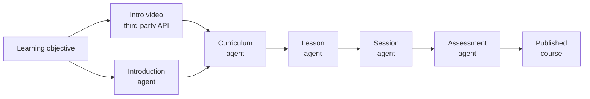
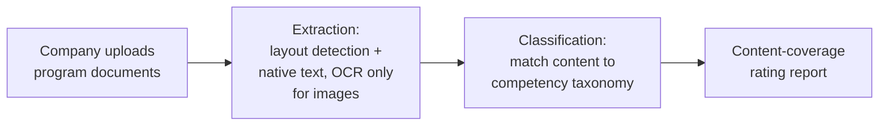
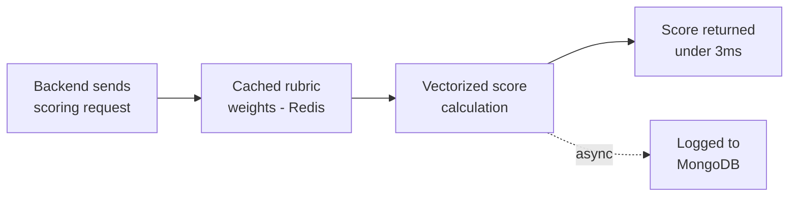
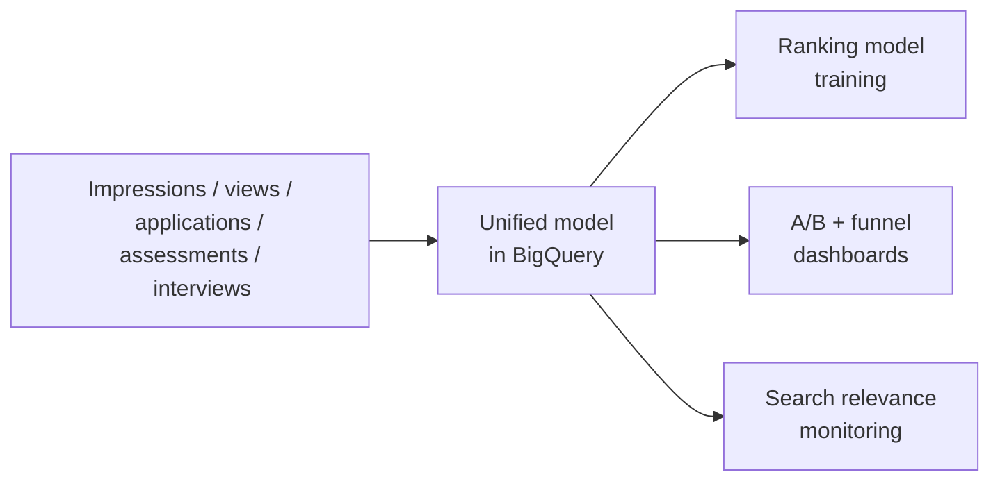
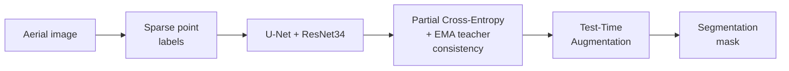

# Muhammad Obaidullah

**Data Scientist · AI Engineer · Backend Engineer**

[Portfolio](https://muhammad-obaidullah.github.io) · [LinkedIn](https://www.linkedin.com/in/m-obaidullah) · obaidullahdsk@gmail.com · +92 334 9841289

---

## About

I am a Data Scientist and Backend Engineer with 4+ years of experience building AI
applications, machine learning workflows and production Python services. I have built NLP
systems that turn complex documents into structured information, hosted GenAI applications
using LangChain, LangGraph and retrieval-augmented generation, and trained and evaluated
deep-learning models on datasets spanning millions of activity records. I have also worked on
the data side - analyzing product behavior and financial risk and led a six-person team
evaluating AI-generated code and ML workflows. My stack is mostly Python, PyTorch, FastAPI,
LangChain/LangGraph, SQL, BigQuery, TypeScript and MongoDB. I also co-authored a paper on
tumour-infiltrating lymphocyte detection using a two-phase deep CNN.

I am currently looking for my next role - Data Scientist, AI Engineer, ML Engineer or
Forward Deployed Engineer. Remote, Onsite, Open to Relocation.

---

## Experience

### GenAI Course-Builder
**DQ Lab, 2024-2025**

The brief was: give it a learning objective and an age group based query, and it generates a full
course: intro, curriculum, lessons, sessions, an assessment, good enough to actually
publish, not just a draft someone has to rewrite. I built this as a chain of agents rather
than one big prompt. A planning agent lays out the curriculum, then separate agents handle
lessons, sessions and the assessment, each picking up from what the last one produced.
Alongside that, a short intro video gets generated through a third-party API, and a
dedicated agent writes the slide that introduces the objective to the learner.

Most of the real engineering was in keeping a five-stage pipeline from quietly breaking
itself. Each agent's output gets validated against a schema before the next one touches it.
Since a full course can take a while to generate, the whole thing runs as a background job
and the app gets a callback when it is actually done, rather than making a request sit and
wait.

Underneath the agents is a generation engine that handles the less glamorous but more
consequential decisions. If a rubric already has a vetted, hand-written outcome, that gets
reused instead of asking the model to reinvent it. There's no reason to spend tokens
regenerating something that's already correct. If the model's unreachable, the module fails cleanly
instead of half-generating something broken. And every regeneration is saved as a new
version instead of overwriting the last one, so one bad run can't cost you the version that
worked.

The loop closes with evaluation: once a learner submits answers, they're scored against the
same rubric the assessment was built from, point by point rather than just right-or-wrong,
so the feedback is actually specific about what they did or didn't demonstrate.

---

### Client Program Onboarding
**DQ Lab, 2023–2024**

Companies submitting a learning program for certification would upload their program
materials - PDFs and Word docs, a mix of tables, screenshots and plain text. The research
team had to manually read through all of it to figure out what competencies the content
actually covered. That's the part I automated.

The interesting decision was how to read the documents in the first place. Running OCR on
everything is slow and introduces errors on text that's already extractable natively from
the PDF. So the pipeline uses a layout model to figure out what each region of a page is:
text, a table, a picture. It then reconciles that against the PDF's own native text layer.
Anything with real text underneath it gets pulled out directly and exactly, tables
included. OCR only kicks in for regions that are genuinely just images, and even then the
image gets cleaned up first to cut down on garbage characters.

Once the text is out, it still needs to land at the right spot in a four-level competency
taxonomy, and a single classifier wasn't reliable enough on its own to do that in one shot.
Each piece of text first gets sorted into a broad competency family, then compared against
reference examples at every level within that family.

Using only the specific-level score causes one problem: a correct answer that doesn't use
the exact words the specific code expects gets scored low, even though it's right. Using
only the broad-level score causes the opposite problem: almost any on-topic answer scores
high, even if it misses the exact thing being graded. Computing both, one pass trusting the
specific score most and one trusting the broad score most, and averaging them gets the
benefit of each without either failure mode.

Both extraction and classification run as their own background workers pulling off a queue,
not as part of the request itself. These documents can take a while to process, and that's
not something an API call should be sitting around waiting on.

---

### Scoring Service
**DQ Lab, 2023**

This was the first thing I touched at DQ Lab. The assessment scoring service had started
life in R. The direct port to Python needed to fit the rest of the production stack, and it
was correct but slow. The use case made that a real problem: a user finishes an assessment,
the backend asks this service for a score, and that score has to show up on the portal
immediately. There's no loading state budgeted for "the server is thinking."

The fix wasn't a clever algorithm, it was moving almost everything out of the request path.
Rubric weights and normalization values don't change per request, so they get computed once
and pulled from Redis instead of being recalculated or re-fetched from the database on
every single call. What's left at request time is just a vectorized calculation over
numbers that are already sitting in cache, which is where Python actually gets to be fast.
Writing the result to MongoDB for history and dashboards happens after the response goes
out, not before, so logging never competes with the thing the portal is actually waiting on.

---

### Unified data model for ranking, experimentation & analysis
**Turing, 2022**

Before this, signals like impressions, job views, applications, assessments, and interviews
lived as separate, disconnected datasets. That made
three different jobs harder than they needed to be: giving ML engineers clean training
data, running trustworthy A/B tests and tracing a product hypothesis back to the events
that actually caused it.

I designed the data model around one BigQuery source of truth connecting every stage of the
funnel, with Vertex AI pipelines keeping it current automatically. That one piece of
infrastructure ended up powering three separate projects: clean, attributable training data
for the ranking model; Mode Analytics dashboards comparing A/B experiments and funnel
conversion off a single consistent dataset instead of per-team pulls; and search-relevance
monitoring against the same unified signal set. Getting there meant fixing duplicate-event
and tracking bugs at the source rather than patching around them downstream, which is most
of why attribution coverage ended up around 75%. The ranking model itself saw roughly a 3%
lift, trained on millions of developer activity records.

---

## Personal project

### Point-supervised segmentation of aerial imagery

Dense, pixel-level labels for aerial imagery are expensive to get, so this project trains
a segmentation model from sparse point labels instead of full masks, and sees how close it
can get to dense-label performance.

The model is a U-Net with a ResNet34 encoder, trained with Partial Cross-Entropy so loss
only applies where a point label actually exists. The first attempt at squeezing signal out
of the unlabeled pixels, comparing the model's own prediction against itself on a flipped
image, was noisy, because the target came from the same still-learning model as the
prediction. Swapping in an EMA teacher, a slow-moving average of the student, gave a far
more stable target to train against. Learning rate turned out to matter more than expected
too: too low and the pretrained encoder barely adapted, so the final rate came from a
controlled sweep rather than a default.

The best configuration combined Partial CE, EMA teacher consistency, and test-time
augmentation, reaching 0.7986 pixel accuracy and 0.6371 mean IoU on the Dubai aerial
imagery dataset.

[→ repo](https://github.com/muhammad-obaidullah/point-supervised-remote-sensing) ·
[→ full technical report](https://github.com/muhammad-obaidullah/point-supervised-remote-sensing/blob/main/reports/technical_report.md)

---

## Education & publication

**BS Computer Science**, Pakistan Institute of Engineering and Applied Sciences, 2021.

Co-authored *Detection of Tumour Infiltrating Lymphocytes in CD3 and CD8 Stained
Histopathological Images Using a Two-Phase Deep CNN*, published in
[Photodiagnosis and Photodynamic Therapy, Elsevier, 2022](https://www.sciencedirect.com/science/article/abs/pii/S1572100021004932).
Contributed the Mask R-CNN architecture customization and data-preprocessing approach.
