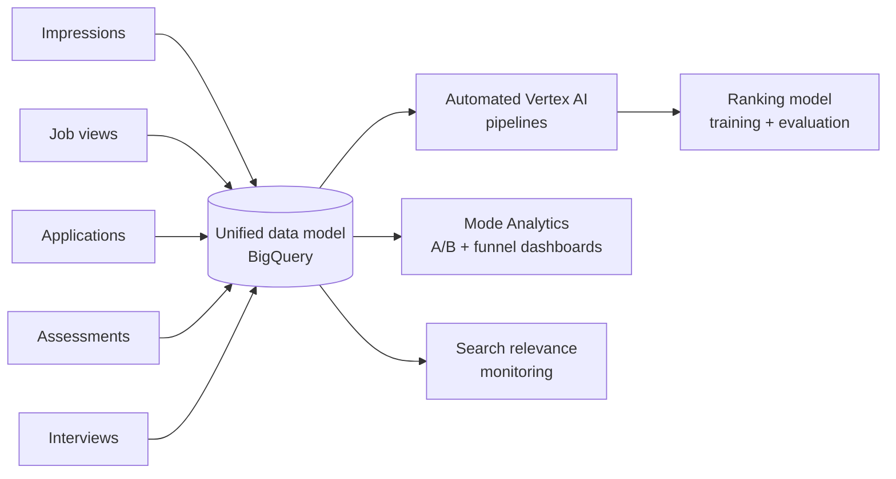
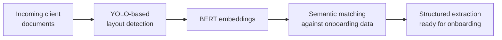
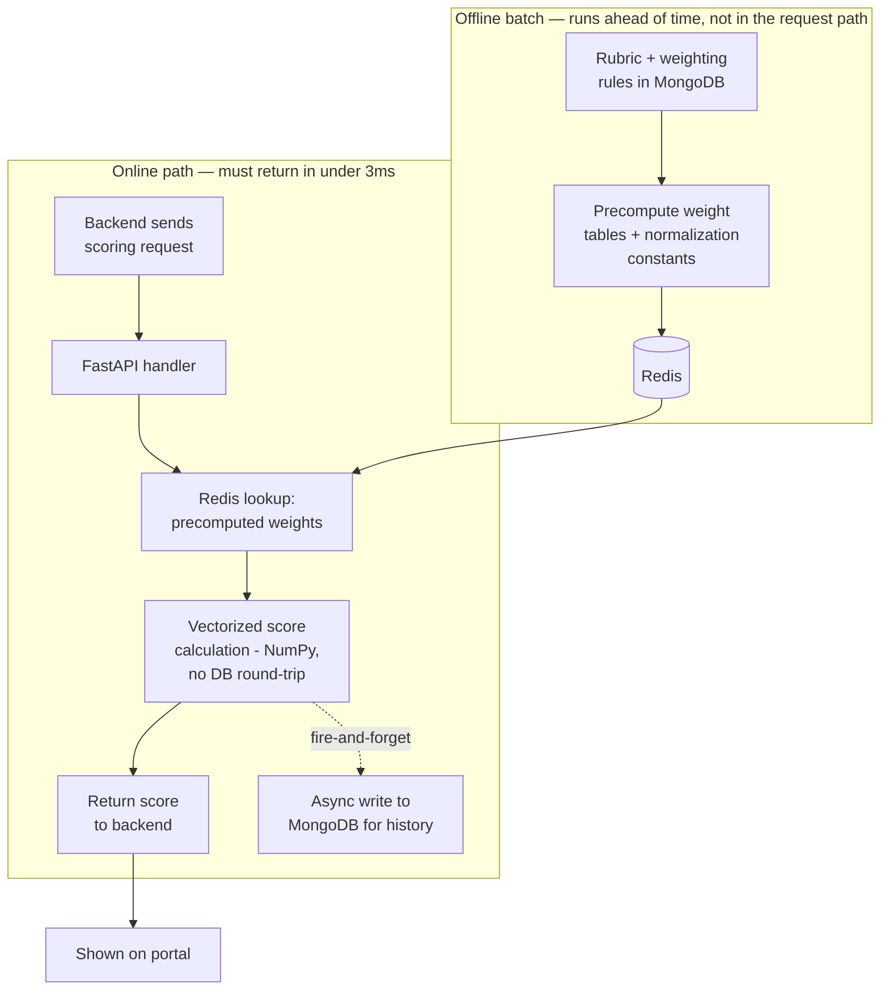
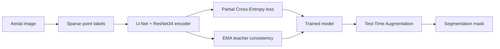

# Muhammad Obaidullah

Data Scientist and backend engineer. I build AI systems that have to actually survive
production — not just a notebook.

Portfolio: [muhammad-obaidullah.github.io](https://muhammad-obaidullah.github.io) · obaidullahdsk@gmail.com · +92 334 9841289

---

### Now

Leading a six-person AI evaluation team at Turing, reviewing generated code and ML
workflows for correctness, dataset usage, and reproducibility.

---

## Case studies

### 1. Agentic GenAI course-builder (DQ Lab)

**Challenge.** Course creators needed full learning materials and assessments generated
for a given audience — not a single AI-written paragraph, but a structured, multi-stage
output (intro, curriculum, lessons, sessions, assessments) that had to be consistent,
gradeable, and reliable enough to publish, hosted as a real application rather than a
one-off script.

**Design.** A sequential pipeline: each stage hands its output to the next, starting from
the raw user query and ending in a publishable course.

Every stage shares the same cross-cutting layer rather than repeating it:

- **Schema validation** — each agent's output is checked against a TypeScript-defined schema before it's handed to the next stage, so a malformed curriculum can't silently produce a broken lesson.
- **Retrieval (ChromaDB)** — any stage that needs reference material pulls it via retrieval instead of relying on the model's memory.
- **Versioned storage (MongoDB)** — output is checkpointed after each stage, so a failure in, say, assessment generation doesn't lose the curriculum and lessons already built.
- **Background processing + callback** — the whole pipeline runs as a background job since end-to-end generation takes too long for a synchronous request; the application is notified via callback when the course is ready.
- **Retry/fallback around the third-party video API** — it's an external dependency outside our control, so the pipeline has to tolerate it failing without failing the whole course.
- **LangSmith tracing** — every agent call and the video API call are traced, so a bad course can be debugged stage-by-stage instead of as one opaque run.

**Key engineering decisions**

| Challenge | How it was tackled | Why this approach |
|---|---|---|
| A flawed curriculum silently breaks every downstream lesson and assessment | Validate each stage's output against its schema before handing it to the next stage, and checkpoint to MongoDB after every stage | Catches bad output where it originates instead of after the whole course is built; a late-stage failure doesn't force regenerating earlier stages |
| The intro-video API is a third-party dependency with no latency/uptime guarantee | Run the pipeline as a background job with retry/fallback around that one call | A slow or failing external call shouldn't take down the entire course build |
| LLM-generated assessments need to stay gradeable, not just readable | Enforce a TypeScript-defined schema at generation time and iterate prompts against LangSmith evaluation traces | Free-text generation doesn't reliably produce a fixed structure a grading system can consume |
| Curriculum, lessons, sessions, and assessments are inherently dependent on each other | Sequential pipeline instead of parallel subagents | Matches the real dependency graph directly, instead of generating stages in parallel and reconciling conflicts afterward |

**Result.** Hosted, end-to-end system generating audience-specific learning materials and
assessments, with prompts iterated and evaluated per agent using LangSmith traces.

**Stack:** OpenAI API, LangChain, LangGraph, LangSmith, ChromaDB, MongoDB, Python,
TypeScript.

---

### 2. Unified data model for ranking, experimentation & analysis (Turing)

**Challenge.** Signals that mattered for the product — impressions, job views,
applications, assessments, interviews — lived as disconnected datasets. That made it hard
to do three different jobs that all depended on the same underlying funnel: give ML
engineers clean training data for a ranking model, run trustworthy A/B tests, and test
product hypotheses with consistent attribution back to the events that caused them.

**Design.** Redesigned the data model around a single BigQuery source of truth connecting
every funnel stage, with automated Vertex AI workflows keeping it current, feeding three
distinct consumers rather than one.

**Use cases this unlocked:**
- **Model training** — clean, attributable training data for the ranking model, contributing ~3% model lift.
- **Experimentation** — Mode Analytics dashboards (SQL) comparing A/B experiments and funnel conversion off one consistent dataset instead of per-team pulls.
- **Hypothesis testing / monitoring** — search relevance tracked against the same unified signal set, plus duplicate-event and tracking fixes that improved overall data reliability.

**Key engineering decisions**

| Challenge | How it was tackled | Why this approach |
|---|---|---|
| Impressions, views, applications, assessments, and interviews didn't share a consistent grain or identifier | Resolved duplicate-event and tracking issues as part of the redesign itself | Fixing attribution at the source, rather than patching it downstream in every consumer, is what made ~75% coverage possible |
| ML training needs raw, granular events; A/B analysis and dashboards need stable, pre-aggregated definitions | One unified base layer in BigQuery, with Vertex AI pipelines and Mode Analytics dashboards each consuming it differently | Avoids maintaining two separate pipelines that could quietly drift out of sync with each other |
| Joining the full funnel history repeatedly across millions of records was too expensive to run often | Precomputed metrics and narrower joins | Keeps recurring queries from reprocessing the same event history every time |
| Needed a warehouse that scales with funnel-event volume and a way to automate recurring ML workflows against it | BigQuery + Vertex AI | BigQuery's columnar storage handles large joins cheaply when the schema is right; Vertex AI automates training/eval runs against that same warehouse without separate ML infrastructure |

**Result.** ~75% attribution coverage across the funnel, ~3% ranking-model lift, built
across millions of developer activity records; query efficiency improved through
precomputed metrics and narrower joins.

---

### 3. Client onboarding OCR/NLP pipeline (DQ Lab)

**Challenge.** Client onboarding required extracting and cross-referencing information
from large volumes of documents — done manually, it was a recurring bottleneck that slowed
every new client down.

**Design.** Designed and built a production pipeline: layout detection isolates the
regions that matter on each document, embeddings turn them into something comparable, and
semantic matching cross-references extracted content against what onboarding actually
needs.

**Key engineering decisions**

| Challenge | How it was tackled | Why this approach |
|---|---|---|
| Client documents don't follow one fixed template | YOLO-based layout detection locates relevant regions by what they are, not where they sit on the page | Fixed-position or regex-based extraction breaks the moment a client's layout differs even slightly |
| Extracted text rarely matches onboarding fields word-for-word | BERT embeddings + semantic matching instead of keyword/regex matching | Clients phrase the same information differently than the onboarding schema expects; semantic matching tolerates that, exact matching doesn't |
| Hundreds of thousands of records couldn't be processed synchronously without stalling onboarding | MongoDB-backed job queues for async processing, Redis caching to avoid reprocessing | Keeps document processing off the critical path of onboarding itself |
| Documents mix tables, stamps, signatures, and free text | Detect layout before generating embeddings, rather than embedding the raw page | Keeps noisy, irrelevant regions out of the embedding step, which made downstream semantic matching noticeably more accurate |

**Result.** Saved approximately 24 hours of manual research per week, running in
production across hundreds of thousands of extracted records via MongoDB-backed job
queues and Redis caching.

---

### 4. Scoring service: R → Python, then making it fast (DQ Lab)

**Challenge.** The original assessment scoring service was written in R. Porting it to
Python for the production stack was necessary, but a direct port was slow.

**Use case.** A user finishes an assessment on the portal → the backend sends this
service a scoring request → it has to compute and return the score in under 3 ms, because
the portal is waiting on that response to render the result on screen. There's no "loading"
state budgeted for a calculation — it has to feel instant.

**Design.** The approach moves everything that doesn't change per-request out of the
request path entirely, so the online path only ever does cheap, cached arithmetic.

**Key engineering decisions**

| Challenge | How it was tackled | Why this approach |
|---|---|---|
| The naive R→Python port kept a MongoDB round-trip and rubric recalculation inside the request path | Precompute rubric weights and normalization constants once, read them from Redis on every request | Rubric data doesn't change per request — recalculating or re-fetching it on every call was the main source of latency |
| The precomputation itself is too heavy to run per request | Runs as a batch job ahead of time, whenever rubric data changes, not inline with scoring | Keeps the online path from ever paying for work that doesn't depend on the current request |
| Row-by-row Python is much slower than R's implicit vectorization | Final score calculation uses NumPy on the already-cached inputs | Matches R's vectorized performance instead of regressing from it |
| Persisting score history competes with response latency | Write to MongoDB for history/dashboards after the response is already sent | The portal is only waiting on the score, not on whether it's logged — decoupling the two keeps logging off the critical path |

**Result.** Response times dropped from 3–5 seconds to under 3 ms.

---

### 5. Point-supervised segmentation of aerial imagery

**Challenge.** Dense, pixel-level segmentation masks for aerial imagery are expensive to
annotate at scale. Goal: accurate building/road/land/vegetation/water segmentation trained
from sparse point labels instead of full masks.

**Design.**

**Key engineering decisions**

| Challenge | How it was tackled | Why this approach |
|---|---|---|
| Comparing a model's prediction against its own prediction on a flipped image gave a noisy, unstable training signal, since the target came from the same still-learning model | Replaced the target with an EMA teacher — a slow-moving average of the student's weights | A target that changes slowly is more stable to train against than one that changes every step; basic same-model consistency only lifted mean IoU marginally even after tuning lambda and confidence threshold |
| Learning rate directly decided whether the pretrained encoder adapted to aerial imagery at all | Ran a controlled sweep: 5e-5 underfit (0.45 mean IoU), 1e-4 was stable but weak (0.57), 2e-4 won (0.61) | Picked from measured comparisons rather than a default value |
| Untrusted teacher pseudo-labels risk reinforcing the teacher's own mistakes | Confidence threshold of 0.8 before a pseudo-label counts toward the loss, plus a 5-epoch warm-up on point labels only before pseudo-labels are introduced | Prevents the student from learning noise during the period the teacher is least reliable |
| EMA decay was a direct accuracy-vs-IoU trade-off (0.995 gave better pixel accuracy, 0.99 gave better mean IoU under TTA) | Selected decay = 0.99 | Mean IoU was the primary metric for this task, so it took priority over pixel accuracy |

**Result.** Best configuration (Partial CE + EMA teacher consistency + TTA) reached
**0.7986 pixel accuracy** and **0.6371 mean IoU** on the Dubai aerial imagery dataset,
beating plain Partial CE (0.7941 / 0.6317).

[→ repo](https://github.com/muhammad-obaidullah/point-supervised-remote-sensing) ·
[→ full technical report](https://github.com/muhammad-obaidullah/point-supervised-remote-sensing/blob/main/reports/technical_report.md)

---

### Background

4+ years across data science and backend engineering: NLP/document extraction, GenAI
applications (LangChain, LangGraph, RAG), ML model training and validation, and the SQL/
BigQuery/Vertex AI side of getting data into a shape models can use.

Co-authored a paper on tumour-infiltrating lymphocyte detection using a two-phase deep CNN
— [Photodiagnosis and Photodynamic Therapy, Elsevier, 2022](https://www.sciencedirect.com/science/article/abs/pii/S1572100021004932).

### Stack

Python · TypeScript · PyTorch · Scikit-learn · XGBoost · FastAPI · LangChain / LangGraph ·
MongoDB · Redis · SQL · BigQuery · Vertex AI · Docker

### Open to

Data Scientist, AI Engineer, ML Engineer, and Forward Deployed Engineer roles — remote,
open to relocation.
